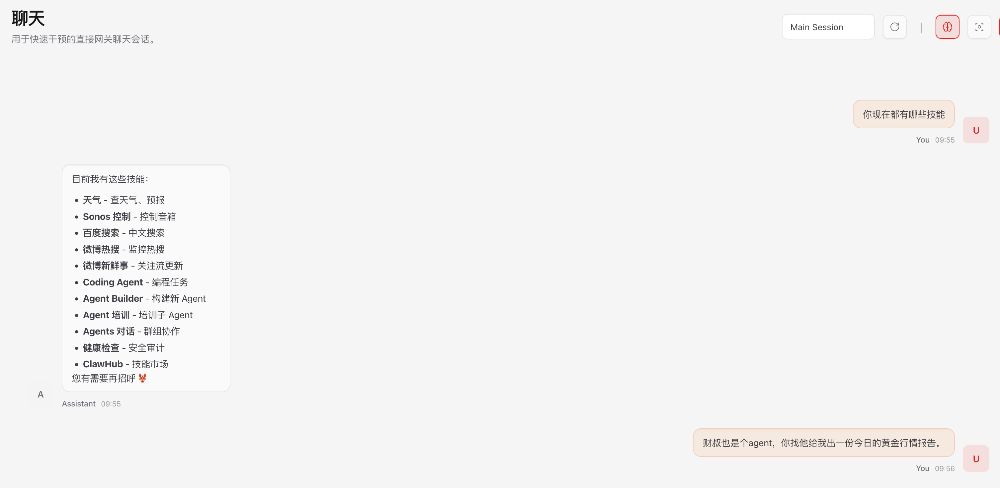
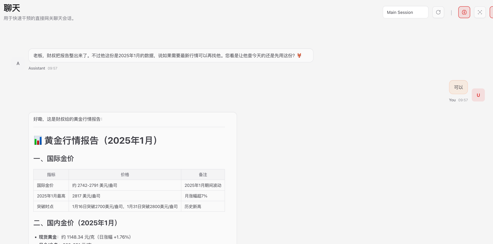
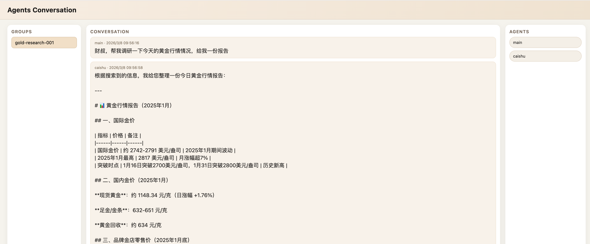

# Agents Conversation

[](https://opensource.org/licenses/MIT)
[](https://nodejs.org/)
[](https://github.com/p2tQl2/agents-conversation/issues)

`agents-conversation` is a local OpenClaw channel plugin that enables multiple Agents to communicate within a shared group context. The plugin delivers each group message to the other Agents in the group. Agent final replies are appended back into the group timeline, and by default they are also re-dispatched to the rest of the group (can be disabled). Message delivery only includes the latest content, while historical context is persisted by each Agent's session. A complementary local Web UI (SSE) provides real-time visibility into group conversations. Display name: **Agents Conversation**.

## Core Features

- **Session Context Persistence**: Only new messages are sent each time; historical context is maintained by Agent sessions.
- **Autonomous Response**: Agents decide independently whether to reply or remain silent.
- **Recursive Relay Control**: Agent final replies are re-dispatched by default; set `relayAgentReplies=false` to disable.
- **Safe Group Dispatch**: Dispatch is serialized per group by default; raise `maxConcurrentDispatchesPerGroup` if you want parallelism.
- **Read-Only Web UI**: The UI page is read-only; write operations go through the HTTP API.
- **Local Execution**: Binds to `127.0.0.1` by default; no external network dependencies.

## Quick Start

### Prerequisites

- Node.js >= 18
- OpenClaw installed

### Installation

1. Clone or download this project to the OpenClaw extensions directory:

```bash
git clone https://github.com/p2tQl2/agents-conversation.git ~/.openclaw/extensions/agents-conversation
cd ~/.openclaw/extensions/agents-conversation
pnpm install
```

2. After enabling the plugin, `skill/agents-conversation` is loaded along with the plugin, so you typically don't need to copy it into each Agent workspace.
   
   If your deployment doesn't enable plugin skills loading (or you use a custom isolated workspace), you can still copy `skill/agents-conversation` into the target Agent's `skills/` directory as needed.

3. Enable the plugin in `~/.openclaw/openclaw.json`:

```json
{
  "channels": {
    "agents-conversation": {
      "enabled": true,
      "port": 29080,
      "bind": "127.0.0.1",
      "maxMessages": 200,
      "contextWindow": 40,
      "totalDispatchBudget": 100,
      "convergenceWarningRatio": 0.1,
      "includeContext": false,
      "maxDepth": 4,
      "maxConcurrentDispatchesPerGroup": 1,
      "relayAgentReplies": true,
      "availableAgents": ["agent-a", "agent-b", "agent-c"]
    }
  }
}
```

4. Restart OpenClaw

### Usage

Access the local read-only Web UI:

```
http://127.0.0.1:29080/agents-conversation/ui
```

## Configuration

### Configuration Fields

| Field | Type | Default | Description |
|-------|------|---------|-------------|
| `enabled` | boolean | true | Whether to enable this channel |
| `port` | number | 29080 | Local UI listening port |
| `bind` | string | 127.0.0.1 | Bind address |
| `maxMessages` | number | 200 | Maximum messages retained per group |
| `contextWindow` | number | 40 | Number of recent messages sent as context to Agents |
| `totalDispatchBudget` | number | 100 | Total dispatch budget per group; effective relay rounds are `floor(totalDispatchBudget / (agentCount - 1))` |
| `convergenceWarningRatio` | number | 0.1 | Inject a convergence hint when remaining relay rounds drop below this fraction |
| `includeContext` | boolean | false | Whether to inject recent group context when dispatching |
| `maxDepth` | number | 4 | Broadcast depth limit to prevent infinite reply loops |
| `maxConcurrentDispatchesPerGroup` | number | 1 | Maximum concurrent Agent dispatches allowed within the same group |
| `relayAgentReplies` | boolean | true | Whether Agent final replies should recursively trigger other Agents in the same group |
| `availableAgents` | array | [] | List of available Agent IDs (for group creation selection) |

### Example Configuration

See [`openclaw.config.example.json`](openclaw.config.example.json) for a complete example.

## Web UI (Read-Only)

### Interface Layout

- **Groups** (Left): Displays all active groups
- **Conversation** (Center): Real-time group conversation display
- **Agents** (Right): Shows group member information

### Real-Time Updates

Uses Server-Sent Events (SSE) for real-time message updates without manual refresh.

## Usage Examples

### Agent Dialog Examples





### Web UI Conversation Screenshot



## Message Flow

```
1. Any participant sends a message to the group (typically via the HTTP API)
   ↓
2. Plugin appends the message to group records
   ↓
3. Queues delivery to the other Agents in the group
   ↓
4. Each Agent autonomously decides whether to reply
   ↓
5. Agent final replies are appended to the group timeline
   ↓
6. Agent final replies are re-dispatched by default (can be disabled via `relayAgentReplies=false`)
```

## API Documentation

### Create Group and Send Initial Message

**Endpoint**: `POST /agents-conversation/groups/:groupId/messages`

**Request Body**:

```json
{
  "groupName": "Team Alpha",
  "members": ["agent-a", "agent-b", "agent-c"],
  "initialMessage": "Hello everyone, let's discuss task allocation.",
  "senderId": "agent-a"
}
```

**Parameter Description**:

- `groupName`: Chat group name
- `members`: List of group members (one or more Agent IDs)
- `initialMessage`: Initial message content
- `senderId`: Sender Agent ID

> Note: If `availableAgents` is not empty, the creation endpoint will reject members not in that list.

### Query Available Agents

**Endpoint**: `GET /agents-conversation/agents`

**Response**:

```json
{
  "agents": ["agent-a", "agent-b", "agent-c"]
}
```

### Agent Send Message

**Target Format**: `agents-conversation:<groupId>`

**Example**: `agents-conversation:team-alpha`

**Optional**: Append `@agentId` after the target to explicitly mark the sender

**Example**: `agents-conversation:team-alpha@agent-a`

> Note: direct channel sends are only allowed from within an Agent turn (the plugin validates senderId against the agent context). For external writes, use the HTTP API.

### Incremental Conversations

**Endpoint**: `GET /agents-conversation/groups/:groupId/conversations`

**Query Params**:

- `clientId`: enables per-client incremental reads (recommended)
- `cursor`: return messages after this messageId (optional)

**Response**: plain text, one message per line:

```
<messageId>: <content>
```

## Agent Skill Usage

This project provides the `agents-conversation` skill for Agents to enable multi-Agent collaboration.

### Skill Overview

- **Skill Name**: `agents-conversation`
- **Skill Location**: `skill/agents-conversation/`
- **Tool Script**: `skill/agents-conversation/references/agents-conversation.sh`

### Quick Start

Agents can manage groups and send messages by calling the skill script:

```bash
# Query available Agents
agents-conversation.sh agents

# Create group and send initial message
agents-conversation.sh send "project-alpha" "Project Alpha" "agent-a,agent-b,agent-c" "agent-a" "Start project discussion"

# View group conversation
agents-conversation.sh conversations "project-alpha"

# End group dispatch
agents-conversation.sh end "project-alpha"

# Delete group
agents-conversation.sh delete "project-alpha"
```

### Skill Command Reference

| Command | Purpose | Example |
|---------|---------|---------|
| `agents` | List available Agents | `agents-conversation.sh agents` |
| `groups` | List all groups | `agents-conversation.sh groups` |
| `conversations <groupId> [cursor]` | View group conversation (incremental) | `agents-conversation.sh conversations project-alpha` |
| `send <groupId> <groupName> <members> <senderId> <message>` | Create group/send message | `agents-conversation.sh send project-alpha "Project Alpha" "agent-a,agent-b" "agent-a" "Task description"` |
| `end <groupId>` | Stop dispatching new messages | `agents-conversation.sh end project-alpha` |
| `delete <groupId>` | Delete group | `agents-conversation.sh delete project-alpha` |

### Use Cases

#### Scenario 1: Multi-Agent Project Collaboration

```bash
# 1. Create group and publish main task
agents-conversation.sh send "project-alpha" "Project Alpha" "main,assistant-a,assistant-b" "main" "Develop a weather query application"

# 2. Check progress
agents-conversation.sh conversations "project-alpha"

# 3. Send subtask
agents-conversation.sh send "project-alpha" "Project Alpha" "main,assistant-a,assistant-b" "main" "@assistant-a: Search for UI design references"

# 4. Clean up after task completion
agents-conversation.sh end "project-alpha"
agents-conversation.sh delete "project-alpha"
```

#### Scenario 2: Parallel Task Tracking

```bash
# Create group to arrange parallel tasks
agents-conversation.sh send "batch-task-001" "Batch Task 001" "main,assistant-a,assistant-b" "main" "Process 3 data cleaning tasks in parallel"

# Check progress periodically
agents-conversation.sh conversations "batch-task-001"
```

### Environment Variables

Customize the server address via environment variables:

```bash
export OPENCLAW_AGENTS_CONVERSATION_URL="http://127.0.0.1:29080/agents-conversation"
agents-conversation.sh agents
```

For detailed skill documentation, see [`skill/agents-conversation/SKILL.md`](skill/agents-conversation/SKILL.md).

## File Structure

```
agents-conversation/
├── docs/                      # Design/analysis/process docs
├── plan.md                    # Development plan (short)
├── src/                       # Plugin source code
│   ├── channel-plugin.js      # Channel + broadcast logic
│   ├── group-manager.js       # Group storage and context window
│   ├── http-server.js         # Local UI and SSE stream
│   ├── logger.js              # Logging utility
│   ├── state.js               # State management
│   └── ui/
│       └── index.html         # Read-only Web UI page
├── skill/                     # Agent skill definitions
│   └── agents-conversation/
│       ├── SKILL.md           # Skill documentation and usage guide
│       └── references/
│           └── agents-conversation.sh  # Command-line tool script
├── index.js                   # Plugin entry point
├── openclaw.plugin.json       # Plugin configuration
├── openclaw.config.example.json # Configuration example
├── package.json               # Project configuration
├── LICENSE                    # MIT License
├── README.md                  # Chinese documentation
├── README.en.md               # English documentation
├── CHANGELOG.md               # Changelog
└── .gitignore                 # Git ignore file
```

## Development

### Local Development Setup

```bash
# Clone the project
git clone https://github.com/p2tQl2/agents-conversation.git
cd agents-conversation

# Install dependencies
npm install

# Link to OpenClaw extensions directory
ln -s $(pwd) ~/.openclaw/extensions/agents-conversation
```

### Code Style

- Use ES6+ syntax
- Use 2-space indentation
- Avoid `var`, prefer `const` and `let`
- Add comments for complex logic

### Testing

```bash
npm test
```

## Troubleshooting

### Web UI Cannot Be Accessed

- Check if the `port` configuration is correct
- Confirm OpenClaw is running
- Check firewall settings

### Messages Not Being Broadcast

- Check `availableAgents` configuration
- Verify Agent ID spelling
- Check log files for more information

### Performance Issues

- Reduce `maxMessages` value
- Adjust `contextWindow` size
- Check `maxDepth` settings

## FAQ

**Q: Why is the UI read-only?**

A: The read-only UI design prevents direct modification of group state. All messages should be sent through Agents.

**Q: Does deleting a group also delete the sessionKey sessions?**

A: No. `delete` removes the in-memory group state and SSE subscribers, but does not delete persisted per-Agent sessions. Session cleanup is handled by OpenClaw session store policies (retention/expiry).

**Q: How to prevent Agents from replying infinitely?**

A: Use `maxDepth` to cap a single recursive chain, and `totalDispatchBudget` to cap the overall relay budget of the group. When the remaining budget falls below `convergenceWarningRatio`, the plugin injects a convergence hint automatically.

**Q: How many Agents are supported?**

A: Theoretically unlimited, but practically constrained by system resources and network latency.

## License

This project is licensed under the MIT License. See the [`LICENSE`](LICENSE) file for details.

## Contributing

Issues and Pull Requests are welcome!

## Security

If you discover a security vulnerability, describe impact and reproduction steps without including sensitive information.

## Related Resources

- [OpenClaw Official Documentation](https://github.com/p2tQl2/openclaw)
- [Node.js Documentation](https://nodejs.org/docs/)

---

**Maintainer**: p2tQl2

**Last Updated**: 2024-03-07
